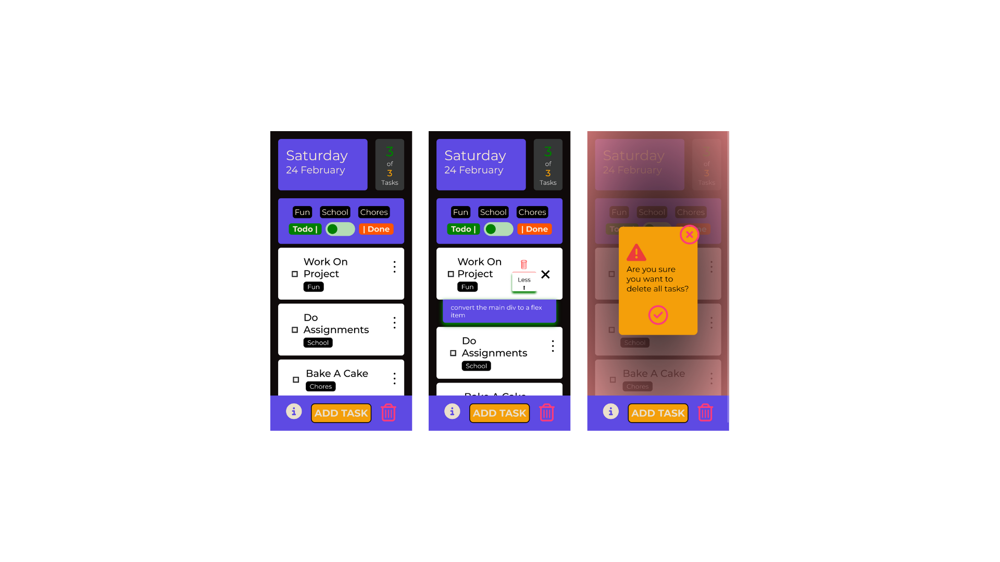

# App Name (SimplePlan)

## Overview

**Vision:** We aim to create a simple and enjoyable web app for managing tasks that anyone can use easily, making it clear and practical for everyday use.

**Users:** Average worker or student, that needs his daily tasks to be organised and easily

**Key Values:** accessible. easy to use, fast, everyday use, practical, for everyone, clear, fun

## Features

- View daily tasks
- Add task
- Add title and description for each task
- Mark task completed
- slider to toggle uncompleted and completed tasks

## App Experience

explore the simplePlan app via [live site](https://chingu-voyages.github.io/v47-tier2-team-13/)

## Team Documents

- [Figma file](https://www.figma.com/file/Vh1YyNdb59fyKBH4paDfNR/Our-project?type=design&node-id=0-1&mode=design&t=gHTozEQwf1c42BSL-0)
- [Miro Board](https://miro.com/app/board/uXjVN6gGsh4=/)
- [Github Project](https://github.com/orgs/chingu-voyages/projects/200/views/3)

## Tech Used / Dependencies

- This is a React App with vanilla CSS
- Add-On packages include
  - [Prettier](https://marketplace.visualstudio.com/publishers/esbenp)
  - [Live server](https://github.com/ritwickdey/vscode-live-server)
  - [Auto Import ES6](https://marketplace.visualstudio.com/items?itemName=NuclleaR.vscode-extension-auto-import)
- Icons - [Fontawesome](https://fontawesome.com/)
- Fonts - [Google Fonts](https://fonts.google.com/)
- Welcome image - [Undraw](https://undraw.co/search)

### Meeting Agenda documents (located in the `/docs` directory in this repo):

- Meeting - Voyage Kickoff --> ./docs/01.10_V47 Kick-off.md
- Meeting - App Vision & Feature Planning --> ./docs/01.11-12_V47_Feature PLanning.md
- Meeting - Sprint Open Topic Session --> ./docs/01.10_V47_open_topic_session.md
- Meeting - Sprint Retro and Planning --> ./docs/01.22_V47_sprint_retrospective_review_and_planning

### Contributors

@ilanza - Product Owner

@BreeMudi - Developer

@Alex Shef - Developer
